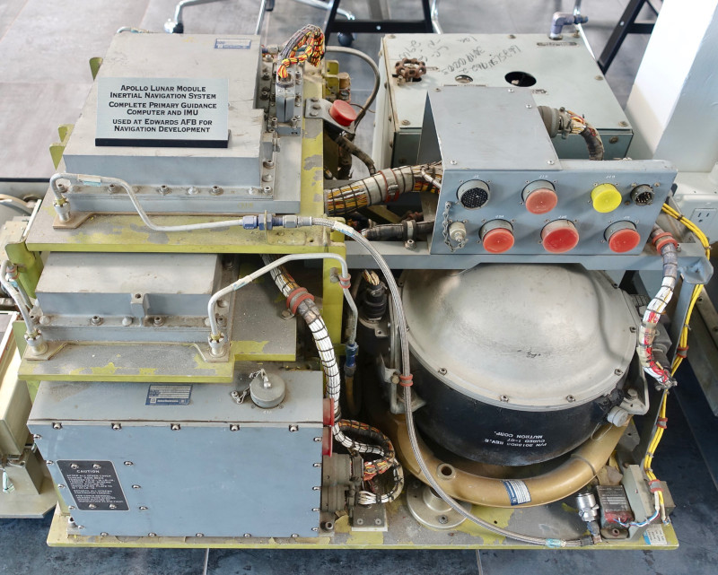
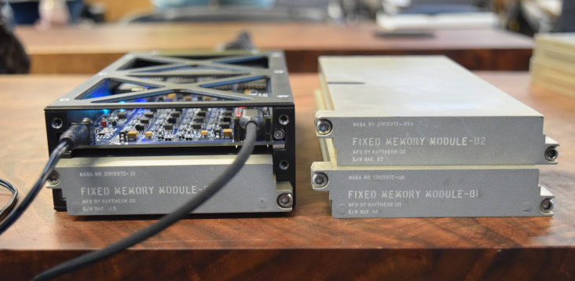

# About the Aurora 88 Executable Program

Aurora 88 was the standard system-checkout software for the LM guidance system.

The file Aurora88-dump.bin contains data dumped by Mike Stewart from physical fixed-memory modules offered to us by Steve Jurvetson. Though these modules were from an F-8 Digital Fly By Wire guidance system, they contained AURORA software rather than the DIGFLY software native to the F-8 Digital Fly By Wire project, so presumably they were being used for system checkout. Here are some nice photos of the guidance system and of the modules being dumped:

There are a surprisingly-large number of differences between these Aurora 88 modules and DAP Aurora 12, which is somewhat-later software forked from an early revision of the Apollo 5 softare Sunburst, and the only other "Aurora" version we have, as of this writing.

The entire program is made up of dumps from 3 separate memory modules, concatenated to form a complete rope.  The dumps of the individual modules are all available in the Rope-Module Dump Library folder of the Virtual AGC source tree, and specifically are the files

* 2003972-011-BLK2-Aurora88-B1.bin
* 2003972-091-BLK2-Aurora88-B2.bin
* 2003972-111-BLK2-Aurora88-B3.bin

As we expected in advance, the B1 and B3 modules are identical to some modules already in the library, namely

* 2003053-061-BLK2-Aurora85+-B1.bin
* 2003053-181-BLK2-Aurora88-B3.bin

The Aurora 88 rope image file in *this* folder, namely Aurora88-dump.bin, is a processed form of the individual-module files in the Rope-Module Dump Library.  First, the individual module dumps have to be concatenated to form a single large file, and second, they have to be converted from "hardware" format to "Virtual AGC" format.  In Linux or Mac OS X, that looks like this:

    cat ... the 3 module-dump files delimited by spaces ... > Aurora88-hardware.bin
    pieceworkAGC.py --bin --add=Aurora88-hardware.bin,1,1,0 >Aurora88-dump.bin
    mv Aurora88-hardware_vagc.bin Aurora88-dump.bin

In Windows, I *presume* &mdash; but don't vouch for it! &mdash; that the equivalent steps would be

    copy /B ... the 3 files, separated by '+' signs ... Aurora88-hardware.bin
    pieceworkAGC.py --bin --add=Aurora88-hardware.bin,1,1,0 >Aurora88-dump.bin
    ren Aurora88-hardware_vagc.bin Aurora88-dump.bin

The **pieceworkAGC.py** program referenced here can be found in the Tools/disassemblerAGC/ folder of the source tree.  The final file mentioned above, Aurora88-dump.bin, is the rope image required by **yaAGC**.  The purpose of the **pieceworkAGC.py** program here is to convert the dumps from a format we call the "hardware" format to the format instead produced by our modern AGC assemblers and accepted by our modern AGC CPU emulators.  The Python 3 programming language is required.  (Actually, the **pieceworkAGC.py** program could have done the entire conversion, eliminating the need for `cat` or `copy` entirely, but the steps listed above are what I did before that fact occurred to me.)

Of course, you don't actually need to *do* this yourself, since the file Aurora88-dump.bin is already present in this folder; but that's how it's done if you need to do it.

