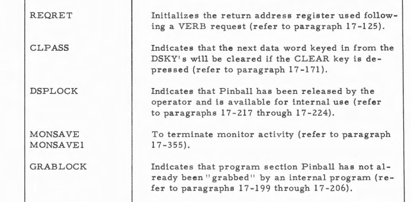
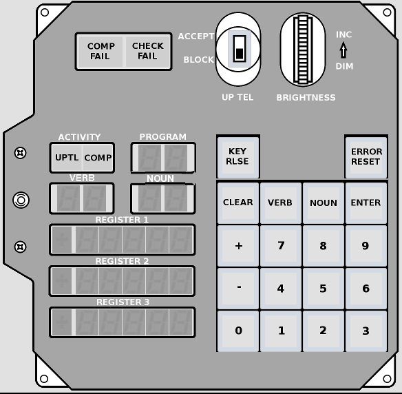

# Contents

  * [Introduction](#Introduction)
  * [Target-Specific Differences](#Target)
  * [Stuck Bits, Parity-Based Fixes, and CCSHOLEs](#Stuck)
  * [Inventory of Dumped Rope-Memory Modules](#Inventory)

# <a name="Introduction">Introduction</a>

In general terms, to date, three methods of recovering Apollo Guidance Computer software have presented themselves to us:

 1. Transcription of source code from Apollo-era printouts.
 2. Readback ("dumps") of physical Apollo-era rope-memory modules containing executable forms of the software.
 3. Reconstruction of source code by simultaneous explotation of similar AGC software versions, application of source-code changes from the Apollo-era paper trail, and separately-obtained knowledge of the correct fixed-memory bank checksums.

The material in *this* folder pertains to the 2nd of these methods.  The folder contains all available dumps which have been made from individual physical AGC rope-memory modules.  Where feasible, and specifically where enough modules of compatible AGC software versions exist, source code has also been reconstructed for them as well.  But not in *this* folder.  Such reconstructions appear elsewhere in the source tree, in folders specific to particular AGC software versions.  

Several file formats are used in Virtual AGC for AGC rope images.  The dumps in this library folder are all "bin" files (as opposed to "binsource" files), in so-called "hardware with parity" format, with the specifics of the format varying somewhat according to the target hardware/softare: i.e., depending on whether the AGC is of type Block I, BLK, or Block II.

The filenames obey the following convention:

    PARTNUMBER-DASHNUMBER-TARGET-AGCSOFTWAREVERSION-MODULE[-NOTES].bin

For example, for file 1003133-20-Sunrise45+-B28-BadStrand7_BrokenCore167.bin,

  * The rope-module part number is 1003133.  The engineering drawing for this part number can be looked up in the Virtual AGC engineering-drawing search engine (if we happen to have a copy of the drawing).   In this case, [the drawing is here](https://archive.org/details/aperturecardbox437naraswimages/page/n414/mode/1up?view=theater).
  * The specific part number, including the dash number is 1003133-20, which the drawing just mentioned informs us in its part list is for module B28.  The drawing also tells us indirectly which AGC software version it relates to, namely "Computer Program Dwg No." 1021102, whose drawing we *don't* have, but which other resources in our document library tell is is Sunrise (version number uncertain without more digging).
  * The TARGET is the hardware/software model for which this software is targeted.  The possibilities are:
    * BlockI
    * BLK2
    * AGC.  (These targets are *all* AGCs, so try not to be confused by the fact this particular target is the only one actually *named* "AGC".)
  * In fact, this module is for AGC software version Sunrise 45, but it remained unchanged for later versions of Sunrise, which is why I've indicated it in the filename as "45+".
  * The module number &mdash; i.e., the AGC slot into which it is plugged &mdash; as I've already mentioned, is B28.
  * Finally, the optional NOTES field is generally present to indicate any hardware faults that were encountered during the dump which may render the dump less useful.  In this example, both "BadStrand7" and "BrokenCore167" are indicated, the former of which is repairable in software (but not yet repaired in this specific file), while the latter can hopefully be worked around (but again, has not been repaired in this specific file).

In general, for the convenience of the software used to transform and/or combine these module dumps into complete AGC executables, the use of commas and hyphens in the filenames (other than those indicated in the template filename pattern above) should be avoided.

# <a name="Target">Target-Specific Differences</a>

The principal target-related differences &mdash; i.e., Block I vs BLK2 vs Block II &mdash; between these dumps are these:

  * The number of 2000₈-word "banks" in each module.
  * The ordering of the banks within the modules.
  * The total number of modules.
  * The naming of the modules.

For Block I target: There are up to 6 rope-memory modules per AGC, with 4 fixed-memory banks per module.  The modules are used in pairs, designated as pair R (modules B28 and B29), pair S (modules B21 and B22), and pair T (modules B23 and B24).  The fixed-memory banks are arranged within the dumped files in the following order.  Notice that the numbering begins at bank 01, and that there are no fixed-memory banks numbered 00, 15, 16, 17, or 20.

  * B21 &mdash; 10, 05, 30, 25
  * B22 &mdash; 06, 07, 26, 27
  * B23 &mdash; 14, 11, 34, 31
  * B24 &mdash; 12, 13, 32, 33
  * B28 &mdash; 04, 01, 24, 21
  * B29 &mdash; 02, 03, 22, 23

For BLK2 or AGC targets:  There are up to 6 rope-memory modules per AGC, with 6 fixed-memory banks per module.  The modules are designated B1 through B6.  The fixed-memory banks are arranged within the dumped files in the following order:

  * B1 &mdash; 00, 01, 02, 03, 04, 05
  * B2 &mdash; 06, 07, 10, 11, 12, 13
  * B3 &mdash; 14, 15, 16, 17, 20, 21
  * B4 &mdash; 22, 23, 24, 25, 26, 27
  * B5 &mdash; 30, 31, 32, 33, 34, 35
  * B6 &mdash; 36, 37, 40, 41, 42, 43

# <a name="Stuck">Stuck Bits, Parity-Based Fixes, and CCSHOLEs</a>

## The Simplified Explanation

Someimtes, dumps from physical rope-memory modules do not contain immediately-usable data, because the modules being dumped are defective in some way.  The most-commonly-encountered problem turns out to have a relatively-easy fix, and since this problem and its fix will be referred to several times later, I'll discuss them in a general way now to avoid repetition.

Note first that each location in fixed memory holds a data word consisting of 15 bits, plus one extra bit, called the "parity bit", for 16 in all.  The parity bit doesn't contain data as such, but provides a way of partially checking whether the 15 bits of actual data are correct.

The "common problem" that I mentioned is a so-called *stuck bit*.  That means that some particular one of the 15 bits, say bit 3 as an example, always is read as a 1 regardless of which address is being queried.  Normally that wouldn't happen, and you'd expect bit 3 to vary between 0 and 1, depending on the address.  We would say that bit 3 is stuck.

Because of the nature of parity bits, this problem is easily repaired by software, as long as *only one* of the data lines is stuck in any particular region of memory.  If more than one data line is stuck in the same range of memory addresses, then correction becomes much harder, and is not always possible.  However, right now I'm just talking about the case of a single stuck data line.

In the case of the AGC, parity bits are *odd*.  This refers to the way they are calculated.  If you express a 15-bit word in binary notation (i.e., 0's and 1's), the parity bit will have been chosen so that an odd number of bits is 1.  For example, suppose the word stored at address 05,3456 is 12345 in octal notation.  In binary,

    001 010 011 100 101

That's 7 bits which are 1.  That's already an odd number, so the parity bit is chosen to be a 0.  But if the word stored at 05,3456 had been 12344 instead, or

    001 010 011 100 100

that's 6 bits which are 1, an even number, so the parity bit would have to be 1.

The way this is applied to correcting a stuck bit is simple:  In all of the words dumped from the module (in the address range for which a stuck bit is causing a problem), simply replace bit 3 (the one we're pretending is stuck) by 0.  Having done that, in each word count the number of bits (including the parity) which are 1.  If the number is even, change bit 3 to a 1.  Stuck-bit problem solved!

The drawback of this fix is that the parity bit can now no longer be used for cross-checking the correctness.  However, you can't have everything!

## Down the Rabbit Hole

As usual with AGC-related matters, it's actually a bit harder and more-complex than the simplified picture painted above suggests.

Perhaps the biggest complicating factor is the problem of "unused" locations in fixed memory.  These are locations where there is no code and no constant data stored.  As you might expect, when the fixed-memory at an unused location is read, it returns the value 00000 (octal).  But the complication is that these unused locations have a parity bit of 0 as well, so these locations have *even parity* in place of the odd parity of all of the used data locations as described above.

So if you simple-mindedly correct all of the data in a stuck-bit memory region by fiddling with the stuck bits to make the parities odd, you will in fact be assigning wrong values to all of the unused memory locations!  In the preceding section, I used as an example the case in which bit 3 is stuck, so if you "corrected" an unused memory location which *should* be

    000 000 000 000 000, parity=0

you'd end up with

    000 000 000 000 100, parity=1

Well, so what?  After all, if there's no code or data stored at an unused location, then what difference does its value make?  A wrong value at that location can't affect the behavior of the software when it's executed, can it?  Yes, you're absolutely right ... but we want the dumps to be 100% accurate if we can manage it.

It occurred to me, and may occur to you that badly-corrected "unused" words would mess up the AGC's built-in self-test code.  Recall that AGC software is protected by checksums that are computed during the built-in self test.  Actually, this isn't literally true, since early software like Block I's Sunrise or BLK2's Retread didn't have them, but it's true for all later software, and certainly for any software flown in missions or used for system checkout.  A checksum, in essence, is a sum of all of the words in a fixed-memory bank, *including* the unused locations at addresses lower addresses where the checksums are stored, so if the unused locations are assigned incorrect values, the checksums will be wrong, and the software is unlikely to pass its built-in self-test, even though executing correctly in every other way.  Well, it turns out that this is *not* a problem, because in AGC software versions that contain the built-in fixed-memory test, there are no unused locations in the body of the code; they're all at the ends of banks, where the checksumming software ignores them.  It has to be this way, because if the built-in self-test encountered a parity error, it would be a fatal error and would cause a hardware restart.  Ergo, no unused memory location can affect software execution.

As I just implied, unused words in fixed memory tend to be in a big bunch at the very ends of the memory banks, so finding those is pretty easy:  You can simply scan backward from the ends of the banks.  Admittedly, there's some ambiguity, because it's certainly possible that the very last "used" word in a bank (generally, the banksum) may coincidentally have the same value (except for parity) as an unused location.

Besides which, cases have been seen in which not all "stuck" bits are actually stuck, but mere *mostly* so, so that some of them may intermittently read correctly.  I'm told this is due to fact that the electronics for reading back a strand of memory involves a pair of matched diodes, which after 50 or 60 years of inactivity are no longer quite so matched as they were back in the Apollo era. 

But in early software versions like Sunrise or Retread that don't have checksums, not *all* unused words are at the ends of the banks, and finding those requires effort ... not to mention experience and knowledge of similar software versions (if any) that is outside of the scope of this discussion.  

Nevertheless, the main example of this kind of thing of which I've been told is what you might call a *CCSHOLE*.  To understand a CCSHOLE, you have to understand the nature of the AGC's `CCS` instruction.  In schematic form, here's the way a `CCS` instruction works:

    ...
    CCS             x
    Instruction1            # Come here if x > 0
    Instruction2            # Come here if x == +0
    Instruction3            # Come here if x < 0
    Instruction4            # Come here if x == -0
    ...

Now, if you knew in advance that the variable `x` was constrained in certain ways, you might know that some of these instructions, say `Instruction3`, could never be reached.  But you have to tell the assembler *something* to do with that address.  There are several things you might do, such as putting a no-op instruction (`NOOP`, `CA A`, etc.) there.  Some software versions literally put an instruction `TC CCSHOLE` there, hence the name CCSHOLE!  Solarium 55 does the latter, for example, and the subroutine `CCSHOLE` is coded as a trap that raises a program alarm signaling an implementation error.

But in early software versions like Sunrise and Retread, these holes were sometimes treated simply as unused memory locations, and that's a problem that must be dealt with for those versions.

# <a name="Inventory">Inventory of Dumped Rope-Memory Modules</a>

Unless otherwise stated, all dumps of physical rope-memory modules &mdash; and corrections to that data, where appropriate &mdash; were performed by **Mike Stewart**, so even though Mike performed all or all of the actual work, I won't keep mentioning him over and over again.  Mike is the default.

As far as dumping the data is concerned, two methods were used.  One involved [the AGC from the collection of Jimmie Loocke, restored in 2019](http://www.ibiblio.org/apollo/Restoration.html), at which point (as far as I know) it became the only functional AGC then in existence.  The method was to insert available rope-memory modules into this AGC, when compatible, and to exploit the AGC to dump their contents.  Eventually, though, the restored AGC became unavailable for this purpose, so an alternate method was needed.  At that point and Mike designed and constructed dedicated rope-memory module reader devices which he could use for dumping additional modules as they became available.

## 1003133-18-BlockI-Sunrise33+-B29.bin

Source:  An anonymous collector.

Software:  Sunrise 33, 38, 45, 69

Flaws:  None known.

## 1003133-19-BlockI-Sunrise38+-B21.bin

Source:  An anonymous collector.

Software:  Sunrise 38, 45, 69

Flaws:  None known.

## 1003133-20-BlockI-Sunrise45+-B28-BadStrand7_BrokenCore167.bin, 1003133-20-BlockI-Sunrise45+-B28-Repaired.bin

See also: 1003733-021-BlockI-Sunrise45+-B28-BadStrand6Parity.bin for additional validation of the repairs discussed.

Source:  An anonymous collector.

Software:  Sunrise 45, 69

Flaws in the raw dump, due to a defective module:

  * Bad Strand 7 (Stuck Bit 7, last quarter of banks 21 and 24):  As described earlier, stuck bits can be corrected with a parity-based fix.  
  * Broken Core 167:  The physical construction of a fixed-memory core rope involves the fact that whether or not data is read as a 0 or a 1 from a specific core depends on whether the wire for reading the data is threaded through the core (which is shaped like a tiny doughnut) or else passes around it.  64 wires are used for any given core &mdash; limited by the thickness of the wire and the size of the hole &mdash; so a broken core affects many locations at similar addresses but perhaps different memory banks.  In the case of core 167, data from the following addresses is lost and the indicated software sections are probably affected:
      * 04,6167: EXECUTIVE
      * 04,6567: PROGRESS CONTROL
      * 04,7167: FRESH START
      * 04,7567: Unwired, so no data loss
      * 24,6167: PINBALL
      * 24,6567: PINBALL
      * 24,7167: PINBALL
      * 24,7567: PINBALL (this location is also affected by the bad bit 7).

### Repairs to 1003133-20

Since [the fix for stuck bits has already been described in some detail](#Stuck), I won't discuss that here.  As far as the 8 words affected by the defective core 167, there are tentative fixes which I'll describe here ... though I'm basically cut-and-pasting from Mike's description of his thinking.  I describe the fixes as "tentative" because the Sunrise software precedes the inclusion of memory-bank checksums ("banksums"), and hence we don't have any way to directly double-check these fixes.  In other words, perhaps the repaired dump for this module might need to be updated at some point in the future.

By the way, heavy reliance is made on the hopefully-similar code from Solarium 55.  That's because Sunrise and Solarium are both software for the Block I AGC, and are the only samples of Block I code as of this writing.

**Fix for 04,6167**: This one is very easy because it's in the middle of `CHANJOB` in EXECUTIVE, which is unchanged from Solarium.

    04,6163  50122 0          TS     PUSHLOC
    04,6164  74605 1          MASK   LOW10
    04,6165  30122 0          XCH    PUSHLOC
    04,6166  40000 0          COM
    04,6167  00000 0          OCT    0000      ; Should be 60122 0 for AD PUSHLOC
    04,6170  50060 1          TS     BANKSET
    04,6171  40120 0          CS     ADRLOC

**Fix for 04,6567**: This was by far the hardest one. It's in a section called PROGRESS CONTROL, which we have no other surviving examples of. Luckily the [AGC Information Series issue #16 (by Raytheon Corporation)](https://www.ibiblio.org/apollo/Documents/agcis_16_fresh_start.pdf#page=9) has a pretty detailed flowchart and even more detailed text descriptions. After trying to match code flow to the flowcharts, I eventually narrowed in on the bad word 04,6567 as the very first instruction of `PHASWT3`. Apparently this code path is never exercised in Sunrise, but nevertheless AGCIS #16 provides the following information about it:

    At this location, program control is transferred to Routine `PHASWT3` 
    which *immediately* passes control on to Routine `ONSKIP`.

As luck would have it, `ONSKIP` is widely referenced in PROGRESS CONTROL and the AGCIS describes it in excruciating detail ("Initially, Routine `ONSKIP` places the complement of the octal quantity 00037 (77740) into the accumulator. Then the content of register `PHASE`, the old phase code, is added to the accumulator and the sum is tested"). And sure enough, our `PHASWT3` that starts with the bad word does not appear to call `ONSKIP` anywhere &mdash; certainly not immediately. So therefore, presumably, the missing word at the very beginning must be a call to `ONSKIP`.

    04,6564  02516 1          TC     BANKCALL
    04,6565  42001 0          CADR   DSPMM
    04,6566  02276 0          TC     PHASEOUT
    04,6567  00000 0 PHASWT3  OCT    0000      ; Should be 06701 1 for TC ONSKIP
    04,6570  02272 1          TC     PHASOUT2
    04,6571  35500 1          CAF    ZERO
    04,6572  06651 0          TC     SETPHASE
    04,6573  34516 1          CAF    ONE
    04,6574  50034 0 PHASWT5  TS     OVCTR

**Fix for 04,7167**: I was afraid of this one at first but it turned out to be easy. This is in `DSPOFF` in FRESH START, where a whole slew of erasables are initialized to 0. It turns out that [AGCS #16 also lists every erasable initialized here](http://www.ibiblio.org/apollo/Documents/agcis_16_fresh_start.pdf#page=41), in the order they're initialized. And [the AGCIS #15 errata has a listing at the end mapping erasable addresses to names](http://www.ibiblio.org/apollo/Documents/agcis_15_errata.pdf#page=49). So:

    04,7165  50624 1          TS     REQRET
    04,7166  50646 0          TS     CLPASS
    04,7167  00202 0          OCT    0202      ; Should be 50623 0 for TS DSPLOCK
    04,7170  50636 1          TS     MONSAVE
    04,7171  50637 0          TS     MONSAVE1
    04,7172  50641 1          TS     GRABLOCK

**Fix for 04,7567**: Freebie! This one is unwired anyways so it remains 00000 0.

**Fix for 24,6167**: This is in or around `ENDECOM` in PINBALL. This code was pretty heavily refactored between Sunrise and Solarium, and the relevant AGCIS issue is incomplete, so we have to use context clues.

Solarium has:

    ENDECOM         XCH     MPAC +2
                    INDEX   INREL
                    TS      XREGLP -2
                    XCH     MPAC +1
                    INDEX   INREL
                    TS      VERBREG
                    TC      ENDALL
    MORNUM          CCS     DSPCOUNT        # DECREMENT DSPCOUNT
                    TS      DSPCOUNT
                    TC      ENDOFJOB

Note that `XREGLP -2` and `VERBREG` are both indexed by `INREL` here. Presumably the same must be true in Sunrise, despite code reordering. So:

    24,6164  40115 0          CS     MPAC +1
    24,6165  50115 1          TS     MPAC +1
    24,6166  40114 1          CS     MPAC
    24,6167  00000 0 ENDECOM  OCT    0000      ; Should be 20075 1 for INDEX INREL
    24,6170  50612 1          TS     VERBREG
    24,6171  30115 1          XCH    MPAC +1
    24,6172  20075 1          INDEX  INREL
    24,6173  50615 0          TS     XREGLP -2
    24,6174  06152 1          TC     ENDALL
    24,6175  10625 1 MORNUM   CCS    DSPCOUNT
    24,6176  50625 0          TS     DSPCOUNT
    24,6177  02115 0          TC     ENDOFJOB

**Fix for 24,6567**: Very easy. This is the first element of table `SINBLANK`, which presumably did not change since the other elements all match.

    24,6565  50625 0          TS     DSPCOUNT
    24,6566  00105 0          TC     WDRET
    24,6567  00000 0 SINBLANK OCT    0000      ; Should be 00016 0 for OCT 16.
    24,6570  00005 1          OCT    5
    24,6571  00004 0          OCT    4
    24,6572  00015 0 DOUBLK   OCT    15
    24,6573  00011 1          OCT    11
    24,6574  00003 1          OCT    3

**Fix for 24,7167**: This is in `TRACE1S` in PINBALL. This code is unchanged from Solarium, so:

    24,7162  50103 0 TRACE1S  TS     COUNT
    24,7163  10000 0          CCS    A
    24,7164  50625 0          TS     DSPCOUNT
    24,7165  07220 0          TC     DSPIN
    24,7166  10075 1          CCS    WDCNT
    24,7167  00000 0          OCT    0000      ; Should be 07146 0 for TC DSPDCWD1.
    24,7170  42775 1          CS     VD1
    24,7171  50625 0          TS     DSPCOUNT
    24,7172  00105 0          TC     WDRET
    24,7173  02476 0 DECROUND OCT    02476

**Fix for 24,7567**: This is in `NVSUBSY1` in PINBALL, which again does not appear to have changed.

    24,7557  50113 1 NVSUBSY1 TS     CADRTEM
    24,7560  10623 1          CCS    DSPLOCK
    24,7561  07564 1          TC     +3
    24,7562  30113 1          XCH    CADRTEM
    24,7563  02566 0          TC     BANKJUMP
    24,7564  35502 0          CAF    TWO
    24,7565  50641 1          TS     GRABLOCK
    24,7566  30113 1          XCH    CADRTEM
    24,7567  00000 0          OCT    0000      ; Should be 30651 0 for XCH DSPLIST +2.
    24,7570  30650 1          XCH    DSPLIST +1
    24,7571  30647 1          XCH    DSPLIST
    24,7572  10000 0          CCS    A

**Test of the repairs**:  As I mentioned above, we don't have any good way to cross-check these conclusions directly, though they seem pretty straightforward.  An *indirect* cross-check is to note that with these fixes in place, we in fact have a complete set of modules (B28, B29, B21, and B22) for Sunrise 69.  The complete executable can thus be formed by concatenating these four dumps.  Moreover, we have a Block I AGC emulator program (**yaAGCb1**) as well as a Block I DSKY emulator program (**yaDSKYb1**).  Combining all of these things, we can in fact run the repaired Sunrise 69 executable.  Here's an animated GIF showing the program in operation without apparent issues.  (Whether it shows up as animated or not in this README is another question.  It may be necessary to download it in order to see it do something.)

But admittedly, this brief test probably does not exercise all of the repaired memory locations, so a more-intensive validation would be desired.

## 1003733-021-BlockI-Sunrise45+-B28-BadStrand6Parity.bin

See also:  1003133-20-BlockI-Sunrise45+-B28-BadStrand7_BrokenCore167.bin, 1003133-20-BlockI-Sunrise45+-B28-Repaired.bin.

Source:  Larry McGlynn.

Software:  Sunrise 45, 69

Flaws:  Strand 6 has bad parity, but no other flaws are known.

This module, though having a different part number, contains the same software revision, Sunrise 45/69, as the previously-dumped module 1003133-20-BlockI-Sunrise45+-B28-BadStrand7_BrokenCore167.bin.  (See preceding section.)  The flaws in that preceding module had already been corrected, and presented as 1003133-20-BlockI-Sunrise45+-B28-Repaired.bin.  That repaired module is identical to the present module, other than the bad strand 6 parity in the present module.  Thus while bad parity is a correctable error, there is no need to actually perform such a correction on the present module, because 1003133-20-BlockI-Sunrise45+-B28-Repaired.bin already contains the full correction.

What's notable, however, is that while some of the corrections previously made to 1003133-20-BlockI-Sunrise45+-B28-BadStrand7_BrokenCore167.bin were straightforward and uncontroversial &mdash; namely, the bad strand 7 of that module &mdash; there had been 8 additional corrections made due to the broken core 167 which while *very likely* correct, were nevertheless made with less confidence than the corrections to strand 7.  Whereas the current module *validates all of the corrections originally made to core 167* in that earlier module.

Thus 1003733-021-BlockI-Sunrise45+-B28-BadStrand6Parity.bin provides a very welcome double-check of all corrections previously made to 1003133-20-BlockI-Sunrise45+-B28-BadStrand7_BrokenCore167.bin, and we can now have a much higher degree of confidence in the recovery of Sunrise 45 and Sunrise 69.

## 1003733-071-BlockI-Sunrise69-B22-BadBit2.bin, 1003733-071-BlockI-Sunrise69-B22-Repaired.bin

Source:  An anonymous collector.

Software:  Sunrise 69

Flaws:  

  * Stuck Bit 2:  The raw dump had this flaw.  A parity fix was applied, and the repaired dump is without known flaws.  Both the flawed raw dump and the repaired dump are provided here.

*Postscript*:  Some time after the module was dumped and repaired, a *second* 1003733-071 module (also belonging to an anonymous collector) was located and dumped, this time flawlessly.  The latter dump was found to be identical, bit-by-bit, to the repaired dump.  This is as we would expect, but it's welcome corroboration of the validity of the method.  Since it's identical to the repaired file, however, I've elected not to provide it as a separate file.

## 1003733-171-BlockI-Corona261-B21.bin

Source:  Jimmie Loocke.

Software:  Corona 261

Flaws:  None known.

## 1003733-191-BlockI-Corona261-B23-SomeDefects.bin, 1003733-191-BlockI-Corona261-B23-Repaired.bin

Source:  Jimmie Loocke.

Software:  Corona 261

Flaws:  This module had three bad diodes:

  * Strand 16 (11,6000 - 11,6377 and 14,6000 - 14,6377) had a bad diode on bit 9.
  * Strand 41 (31,6400 - 31,6777 and 34,6400 - 34,6777) had a bad diode on bit 15 (the parity bit).
  * Strand 42 (31,7000 - 31,7377 and 34,7000 - 34,7377) had a bad diode on bit 4.

Each of these was correctable by the [stuck-bit parity fix](#Stuck) described earlier, and the fixes could be double-checked via memory-bank checksums.

## 1003733-211-BlockI-Corona261-B24-SomeDefects.bin, 1003733-211-BlockI-Corona261-B24-TentativelyRepaired.bin

Source:  Jimmie Loocke.

Software:  Corona 261

Flaws:  This module had so many problems that it was at the limit of what's fixable without physically opening the memory module and repairing it ... something which collectors of such objects are typically not very keen about doing.  However, we have pretty good confidence that it was repaired and is correct.  Four strands were problematic.  Let's look at the two "easy" ones first:

  * Strand 46 (32,7000 - 32,7377 and 33,7000 - 33,7377) had one bad diode on bit 3.
  * Strand 47 (32,7400 - 32,7777 and 33,7400 - 33,7777) had one bad diode on bit 7.

These strands were both correctable via the [stuck-bit parity fix](#Stuck).

However, each of the two remaining "difficult" strands, on the other hand, had *two* bad diodes, which made the stuck-bit parity fix inapplicable.  Fortunately, some workarounds were available:

  * Strand 21 (12,6400 - 12,6777 and 13,6400 - 13,6777) had two bad diodes. One on bit 14 was an open circuit, which made bit 14 completely unrecoverable without parity correction techniques. One diode on bit 12 had a dramatically lower forward voltage than it should. As a result, the diodes on bit 12 were so unbalanced that upward-going `1`s just barely made it out, while downward-going `1`s were blocked. It was possible to work around this, however, with alterations to the hardware of the custom rope-reader device used to perform the dumps.  (Technically, the workaround was that the cycle timing on the rope reader was changed so that the sense amplifiers were enabled both during set and during reset for each core in the strand. Upward-going `1`s thus made it out during the `set` cycle, and downward-going ones got "flipped over" and made it out during the `reset` cycle.)  Bit 12 in this strand was then manually corrected to a `1` when either the set or the reset of an oscilloscope trace displayed a voltage pulse, and to a `0` when neither did.  (Reports of all oscilloscope traces were generated for archival purposes, but given that the report is 90MB, zipped, they're not being provided online.  Bit 7 in this strand also appeared a bit marginal on the oscilloscope traces so a report was generated for it as well, but resulted in no manual corrections.) After these manual corrections were performed to bit 12, word parity was recalculated. Then bit 14 was repaired using the resulting new parity in each word.
  * Strand 23 (12,7400 - 12,7777 and 13,7400 - 13,7777) had two bad diodes. Bit 13 was similarly bad to bit 12 of strand 21, and the same set/reset sampling was performed. Bit 7 also had a diode that was just barely bad, although it only resulted in a wrong reading on a single word. Parity was used to correct bit 7 for that one word, and bit 13 elsewhere.

As with all Corona 261 modules, the fixes were cross-checked via the validity of the memory-bank checksums.  This is not a 100% guarantee of accuracy, however, as there have been known cases of correct memory-bank checksums in spite of existing memory errors.  Additionally, Corona 261 has been "flown" successfully in a simulated AS-202 mission in the Orbiter/NASSP spaceflight-simulator system.  But neither is this any guarantee of accuracy.

Regeneration of Corona 261 source code is in progress.  This is a process of using existing Solarium 55 source code, other AGC source code, [the documentation of differences between AS-202 and AS-501 software](http://www.ibiblio.org/apollo/Documents/Programming%20Changes%20from%20AS-202%20to%20AS-501.pdf), and of course the dump of Corona 261.  Successful regeneration of the Corona 261 source code would be yet another confidence builder ... but as of this writing, the conclusion of that process is still in the future.

## 1003733-221-BlockI-Corona261-B28-SomeDefects.bin, 1003733-221-BlockI-Corona261-B28-Repaired.bin

Source:  Jimmie Loocke.

Software:  Corona 261

Flaws:  This module had one bad diode and one broken core.

First, consider the bad diode

  * Strand 27 (21,7400 - 21,7777 and 24,7400 - 24,7777) had a bad diode on bit 11.

This was correctable via the [stuck-bit parity fix](#Stuck).

Second, core 62 was broken. This resulted in the total loss of data from 8 words, 4 of them in each of two memory banks. In each of 8 cases, the missing word appeared in a section of code otherwise identical to corresponding code in the Solarium 55 program.  Note that Solarium 55 was the successor program to Corona 261, used on the very next mission (Apollo 4 vs AS-202), and that in spite of the different program name is understood to be very similar.  Indeed, a number of reports from the time refer to the software from Apollo 4 (and Apollo 6) as being "Corona" rather than as being "Solarium".  Besides which, we have a document titled ["Programming Changes from AS-202 to AS-501"](http://www.ibiblio.org/apollo/Documents/Programming%20Changes%20from%20AS-202%20to%20AS-501.pdf) which purports (and actually seems) to outline all of the differences between the two.  What you see below is a list of each of the 8 chunks of code, with the missing data due to the broken core shown as `OCT 00000` and accompanied by a comment as to octal value the location *should* have if corresponding to Solarium:

  * 2062: in `JOBWAKE` in section `EXECUTIVE`.
       <pre>
       2060  50573 0 JOBWAKE  TS     EXECTEM2
       2061  10001 1          CCS    Q
       2062  00000 0          OCT    00000      ; Should be 50600 1 for TS WTEXIT
       2063  02071 0          TC     EXECSW
       2064  06110 1          TC     JOBWAKE2
       2065  50600 1 EXECCOM  TS     WTEXIT
       </pre>
  * 2462: in `DNPHASE5` in section `DOWN-TELEMETRY PROGRAM`.
       <pre>
       2455  10674 0 DNPHASE5 CCS    TMINDEX
       2456  02450 1          TC     PHASE5A
       2457  32555 0          CAF    LPHASE6
       2460  50673 0          TS     DNTMGOTO
       2461  32562 1          CAF    LTHLSTB
       2462  00000 0          OCT    00000      ; Should be 50674 1 for TS TMINDEX
       2463  34473 0          CAF    NOMRKRS
       2464  50676 0          TS     MARKERCT
       2465  32566 0          CAF    LISTBANK
       2466  30015 0          XCH    BANKREG
       </pre>
  * 3062: in `NEWABORT` in section `ALARM AND DISPLAY PROCEDURES`.
       <pre>
       3056  11763 0          CCS    FAILREG
       3057  03062 0          TC     SETMULTF
       3060  03064 0          TC     NEWABORT
       3061  03061 0 WHIMPER  TC     WHIMPER
       3062  00000 0 SETMULTF OCT    00000      ; Should be 64664 1 for AD CSQ
       3063  03066 1          TC     +3
       3064  03044 1 NEWABORT TC     PROGLARM
       3065  30577 1          XCH    ITEMP1
       </pre>
  * 3462: in `FLAG2DWN` in section `202 MISSION CONTROL PROGRAM`.
       <pre>
       3460  20001 1 FLAG2DWN INDEX  Q
       3461  40000 0          CS     0
       3462  00000 0          OCT    00000      ; Should be 20017 0 for INHINT
       3463  70647 0          MASK   FLAGWRD2
       3464  50647 1          TS     FLAGWRD2
       3465  20016 1          RELINT
       3466  20001 1          INDEX  Q
       3467  00001 0          TC     1
       </pre>
  * 21,6062: in `TOP33` in section `PRELAUNCH ALIGNMENT PROGRAM`. This word is not *bit-for-bit* identical to Solarium because the fixed memory constant `SCNBMAT` moved in bank 26. However, none of the surrounding code changed, so it is quite unlikely that this line did.
       <pre>
       21,6054  47575 0          NOLOD  1
       21,6055  47065 1          COMP   AST,1
       21,6056  00007 0                 6
       21,6057  32013 1          STORE  10D
       21,6060  74175 1 TOP33    VMOVE* 1
       21,6061  51622 0          VXM    VSLT
       21,6062  00000 0          OCT    00000      ; Should be 33461 1 for SCNBMAT +18D,1
       21,6063  00001 0                 0
       21,6064  00002 0                 1
       21,6065  37241 1          STORE  XNB +18D,1
       </pre>
  * 21,6462: in `SPITGYRO` in section `PRELAUNCH ALIGNMENT PROGRAM`.
       <pre>
       21,6454  37042 0 SPITGYRO CAF    LGYROANG
       21,6455  05654 0          TC     BANKCALL
       21,6456  31421 1          CADR   GYRODPNT
       21,6457  05654 0          TC     BANKCALL
       21,6460  30331 0          CADR   IMUSTALL
       21,6461  02124 1          TC     ENDOFJOB
       21,6462  00000 0          OCT    00000      ; Should be 02124 1 for TC ENDOFJOB
       21,6463  11320 0 NOGYROCM CCS    GYROCSW
       21,6464  06470 1          TC     MORE
       21,6465  02362 1          TC     NEWMODE
       </pre>
  * 21,7062: in `PRELTER1` in section `PRELAUNCH ALIGNMENT PROGRAM`.
       <pre>
       21,7054  35501 0          CAF    ZERO
       21,7055  51340 1          TS     GYROANG
       21,7056  51342 0          TS     GYROANG +2
       21,7057  51344 0          TS     GYROANG +4
       21,7060  31452 0          XCH    THETAX
       21,7061  51341 0          TS     GYROANG +1
       21,7062  00000 0          OCT    00000      ; Should be 31446 0 for XCH THETAY
       21,7063  51343 1          TS     GYROANG +3
       21,7064  31450 1          XCH    THETAZ
       21,7065  51345 1          TS     GYROANG +5
       21,7066  20017 0          INHINT
       </pre>
  * 21,7462: in `MAKEXSM` in section `PRELAUNCH ALIGNMENT PROGRAM`.
       <pre>
       21,7455  02362 1          TC     NEWMODE
       21,7456  00002 0          OCT    02
       21,7457  02124 1          TC     ENDOFJOB
       21,7460  77576 0 MAKEXSM  EXIT   0
       21,7461  37554 1          CAF    XVII
       21,7462  00000 0          OCT    00000      ; Should be 50077 1 for TS BUF
       21,7463  35501 0          CAF    ZERO
       21,7464  20077 0          INDEX  BUF
       21,7465  51424 1          TS     XSM
       </pre>

As I mentioned above, there is a document describing the differences between Corona 261 and Solarium 55, so one should ask whether any of the 8 chunks of code listed above *should* differ from Solarium.  As it happens, the differences document isn't organized on a subroutine-by-subroutine basis; we can't actually look up (say) `MAKEXSM` and say, "Nope, no differences!"  So while it is difficult to be certain under these circumstances, I've looked at the 8 chunks of code above in relation to the difference document, and find no differences relevant to them.  My own conclusion is that we should expect these chunks in Corona 261 to match their counterparts in Solarium 55.

All of the changes above were cross-checked using memory-bank checksums.

## 1003733-231-BlockI-Corona261-B29-SomeDefects.bin, 1003733-231-BlockI-Corona261-B29-Repaired.bin

Source:  Jimmie Loocke.

Software:  Corona 261

Flaws: This module had a single bad diode:

  * Strand 04 (4000 - 4377 and 03,6000 - 03,6377) has a bad diode on bit 4.

This was correctable by the [stuck-bit parity fix](#Stuck) described earlier, and the fix could be double-checked via memory-bank checksums.

## 1003733-241-BlockI-Corona261-B24.bin

Source:  Jimmie Loocke.

Software:  Corona 261

Flaws:  None known.

## 1003733-251-BlockI-SunspotX-B21-7BadDiodes.bin

Source:  Dr. Nick Gessler

Software:  Sunspot, specific version number unknown; but this module (and its companions described below) are from the first release of Sunspot, presumably assembly 1021107-011. 

Comments:  Note that this rope module and its companions had deteriorated considerably before coming into the hands of Dr. Gessler. There are holes in the potting so deep the wires are visible in some of them, and there is a significantly larger number of dead or dying diodes (or broken wires) in these modules than in any modules previously encountered, greatly complicating data recovery.  Aside from that, the available set of modules was missing module B23 (presumably p/n 1003733-271); thus even if all data were fully recoverable, our dump of this version of Sunspot would nevertheless be incomplete until module B23 is located and dumped.

Flaws:  There are approximately 7 bad diodes.  Full data recovery is expected.

## 1003733-261-BlockI-SunspotX-B22-1BadDiode.bin, 1003733-261-BlockI-SunspotX-B22-Repaired.bin

Source:  Dr. Nick Gessler

Software:  See 1003733-251-BlockI-SunspotX-B21-7BadDiodes.bin above.

Comments:  See 1003733-251-BlockI-SunspotX-B21-7BadDiodes.bin above.

Flaws:  There was 1 bad diode (strand 6).  Specifically, strand 37 has a bad bit 3, repaired using the parity method.

## 1003733-281-BlockI-SunspotX-B24-ManyBadDiodes.bin

Source:  Dr. Nick Gessler

Software:  See 1003733-251-BlockI-SunspotX-B21-7BadDiodes.bin above.

Comments:  See 1003733-251-BlockI-SunspotX-B21-7BadDiodes.bin above.

Flaws:  There are many bad diodes.  One strand has 7 bad diodes by itself.  Full data recovery is *not* expected.

## 1003733-291-BlockI-SunspotX-B28-20BadDiodes.bin

Source:  Dr. Nick Gessler

Software:  See 1003733-251-BlockI-SunspotX-B21-7BadDiodes.bin above.

Comments:  See 1003733-251-BlockI-SunspotX-B21-7BadDiodes.bin above.

Flaws:  There are approximately 20 bad diodes.  However, it is expected that all data *except* the last strand will be recoverable.

## 1003733-311-BlockI-SunspotX-B29-ManyBadDiodes.bin

Source:  Dr. Nick Gessler

Software:  See 1003733-251-BlockI-SunspotX-B21-7BadDiodes.bin above.

Comments:  See 1003733-251-BlockI-SunspotX-B21-7BadDiodes.bin above.

Flaws:  There are many bad diodes.  Full data recovery is *not* expected.

## 2003053-031-BLK2-Retread50-B1-BadBits.bin, 2003053-031-BLK2-Retread50-B1-Repaired.bin

Source:  Computer History Museum, Mountain View, California.

Software:  Retread 50

Flaws:

  * Bad Bit 14:  In the raw dump, in the first half of bank 00, bit 14 was stuck HIGH.  
  * Bad Bit 3:  In the raw dump, in the first half of bank 04, bit 3 was usually (but not always) stuck HIGH. 

A more-exact way of describing the problem is that strands 1 and 9 were bad.  As described earlier, stuck bits can be repaired by a parity-based fix.  For illustrative purposes, library contains both the raw version with its flaws and the repaired version.

## 2003053-041-BLK2-Retread50-B2.bin

Source:  Computer History Museum, Mountain View, California.

Software:  Retread 50

Flaws:  None known.

## 2003053-061-BLK2-Aurora85+-B1.bin

Source:  Anonymous collector

Software:  Aurora 85, 88

Flaws:  None known.

## 2003053-071-BLK2-Aurora85-B2.bin

Source:  Anonymous collector

Software:  Aurora 85

Flaws:  None known.

## 2003053-121-BLK2-SundialB+-B1.bin

Source:  MIT Museum

Software:  Sundial B, D, E

Flaws:  None known.

## 2003053-131-BLK2-SundialB-B2.bin

Source:  Anonymous collector

Software:  Sundial B

Flaws:  None known.

## 2003053-151-BLK2-SundialE-B2.bin

Source:  MIT Museum

Software:  Sundial E

Flaws:  None known.

## 2003053-181-BLK2-Aurora88-B3.bin

Source:  Anonymous collector

Software:  Aurora 88

Flaws:  None known.

## 2003972-011-BLK2-Aurora88-B1.bin

Source:  Steve Jurvetson

Software: Aurora 88

Flaws:  None known.

## 2003972-091-BLK2-Aurora88-B2.bin

Source:  Steve Jurvetson

Software: Aurora 88

Flaws:  None known.

## 2003972-111-BLK2-Aurora88-B3.bin

Source:  Steve Jurvetson

Software: Aurora 88

Flaws:  None known.

## 2003972-211-BLK2-SundialE-B3.bin

Source:  MIT Museum

Software:  Sundial E

Flaws:  None known.

## 2003972-371-AGC-Sundance292-B1.bin

Source:  Anonymous collector

Software:  Sundance 292

Flaws:  None known.

## 2003972-391-AGC-Sundance292-B3.bin

Source:  Anonymous collector

Software:  Sundance 292

Flaws:  None known.

## 2003972-421-AGC-Sundance292-B5.bin

Source:  Anonymous collector

Software:  Sundance 292

Flaws:  None known

## 2003972-451-AGC-Sundance302-B2.bin

Source:  Don Eyles

Software:  Sundance 302

Flaws:  None known

## 2003972-461-AGC-Sundance302-B3.bin

Source:  Don Eyles

Software:  Sundance 302

Flaws:  None known

## 2003972-471-AGC-Sundance302-B4.bin

Source:  Eldon Hall

Software:  Sundance 302

Flaws:  None known

## 2003972-641-AGC-Sundance306-B6.bin

Source:  Anonymous collector

Software:  Sundance 306

Flaws:  None known

## 2010802-021-AGC-Comanche72-B2.bin

Source:  Anonymous collector

Software:  Comanche 72

Flaws:  None known

## 2010802-171-AGC-LM131rev1-B5.bin

Source:  Anonymous collector

Software:  LM131rev1

Flaws:  None known

## 2010802-541-AGC-Skylark48-B1.bin

Source:  [New Mexico Museum of Space History](https://www.nmspacemuseum.org/), Executive Director Chris Orwoll

Thanks:  Larry McGlynn

Software:  Skylark48

Flaws:  None known

## 2010802-551-AGC-Skylark48-B2.bin

Source:  [New Mexico Museum of Space History](https://www.nmspacemuseum.org/), Executive Director Chris Orwoll

Thanks:  Larry McGlynn

Software:  Skylark48

Flaws:  None known

## 2010802-561-AGC-Skylark48-B3.bin

Source:  [New Mexico Museum of Space History](https://www.nmspacemuseum.org/), Executive Director Chris Orwoll

Thanks:  Larry McGlynn

Software:  Skylark48

Flaws:  None known

## 2010802-571-AGC-Skylark48-B4.bin

Source:  [New Mexico Museum of Space History](https://www.nmspacemuseum.org/), Executive Director Chris Orwoll

Thanks:  Larry McGlynn

Software:  Skylark48

Flaws:  None known

## 2010802-581-AGC-Skylark48-B5.bin

Source:  [New Mexico Museum of Space History](https://www.nmspacemuseum.org/), Executive Director Chris Orwoll

Thanks:  Larry McGlynn

Software:  Skylark48

Flaws:  None known

## 2010802-591-AGC-Skylark48-B6.bin

Source:  [New Mexico Museum of Space History](https://www.nmspacemuseum.org/), Executive Director Chris Orwoll

Thanks:  Larry McGlynn

Software:  Skylark48

Flaws:  None known

