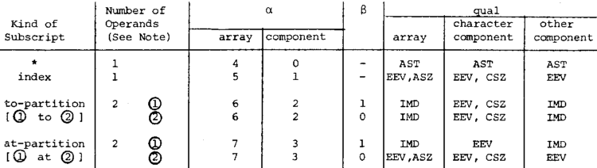

# Executive Summary

While I got quite a way with this effort to reconstruct HALMAT, ultimately there just isn't enough information to do so other than in a "capture the spirit of it" kind of way.  I think this is a dead end until/unless more surving documentation about HALMAT shows up.

# Introduction

HALMAT was the "intermediate language" used by the
original HAL/S compilers (HAL/S-360 and HAL/S-FC) from the Space Shuttle's 
software-development era.  

"Phase 1" of the compiler parsed the HAL/S source
code for flight code like PASS or BFS, producing a HALMAT description of it, which was then passed along to 
"Phase 2" of the compiler for code generation. Since HALMAT was independent 
of the choice of target system, the same compiler front-end ("Phase 1") could 
be used for any target system, be it an IBM System/360 mainframe or an IBM AP-101S onboard Space Shuttle computer, 
simply by replacing Phase 2 of the compiler.  

In principle, I think you could even create a VM that executes HALMAT 
directly.  That's the kind of thing I would *like* to explore in the 
modern HAL/S compiler.  The problem is that there is no surviving 
documentation that I've been able to find so far that gives anything
more than a fragmentary description of HALMAT.  There are three documents
I'd like to find in this regard:

1. "HAL/S-360 Compiler System Specification", Appendix A.
2. "HAL/S-FC Compiler System Program Description Document", Appendix A.
3. "HALMAT - An Intermediate Language of the First HAL Compiler"

The first of these is what is referenced most often as the full description
of HALMAT.  The second is supposed to duplicate the same description as in
the first document.  The third ... well, I don't know just what that is, but
it sounds pretty darned helpful.

The problem is that we have neither of the latter two documents.  While we do 
have one revision of the first document (see the References sections below), that particular scan contains only
the pages that were changed from the preceding revision.  So not only is the full document incomplete, the vital Appendix A is 80% missing.
Early or later revisions may have a complete Appendix A.  

Confusingly, we *do* have "HAL/S-FC & HAL/S-360 Compiler System Program
Description", which seemingly would be a combo of documents 1 and 2 mentioned
above, but it doesn't have the all-important Appendix A.

All of that notwithstanding, rather than completely reinventing the wheel, I'd still like the intermediate code the modern
compiler produces to remain as similar as possible to HALMAT.  Even though
there's no complete description I can put my finger on, there's still a lot
of fragmentary info about HALMAT spread across the documentation we do have.

My hope is that even lacking a standalone contemporary complete description of HALMAT, the sum of the fragmentary descriptions still may be enough to reconstruct a reasonably-complete description.  This file is my attempt to consolidate all of that fragmentary information and use it for reconstruction.

# Digression: FOIA

Among the desired documents listed in the Introduction above, I do find that a couple of them were listed among those available in the [Document Index for the JSC Technical Library as of 1988](https://www.ibiblio.org/apollo/Documents/19900007273.pdf).  Whereas I do *not* find them listed today at the [JSC History Search Index](https://historycollection.jsc.nasa.gov/), which I believe is the list of documents sent from JSC to the University of Houston Clear Lake (UHCL) Archives.

As an aside, the "DOC. #" listed in the JSC Document Index just mentioned appears to be *nnnnn* portion of MSC-*nnnnn* or JSC-*nnnnn* document numbers, with the "MSC" designation changing over to "JSC" sometime between MSC-07765 and JSC-07904.  As far as the specific documents of interest to us right now are concerned, that means that the JSC Technical Library had:

1. JSC-13633, "HAL/S-360 Compiler System Specification".
2. (n/a)
3. MSC-01847, "HALMAT - An Intermediate Language of the First HAL Compiler".

That being the case, it's entirely possible that these documents are *still* at JSC and can be freed up via an FOIA request.  In point of fact, on 2022-12-17 I submitted a NASA FOIA request for those items, under that very assumption.  

Update:  I have indeed (2023-03-03) received these documents.  Unfortunately, the "HAL/S-360 Compiler System Specification" turns out to just be the identical incomplete document we already had; indeed, the new scan is obviously taken from the same physical copy as the one we already had (from NTRS).  On the other hand, ["HALMAT - An Intermediate Language of the first HAL Compiler"](http://www.ibiblio.org/apollo/Shuttle/HALMAT%20-%20An%20Intermediate%20Language.pdf) is indeed a complete description of HALMAT as far as I can tell.  Nevertheless, it conforms to a "preliminary" version of the compiler and clear differs in various details from the eventual specification of HALMAT.  In other words, the good news is that we did get the documents I requested, but they turn out to be of limited use.

# References

The data collected here, and any reconstruction of HALMAT performed, is based on the following documents:

  1. ["HAL/S-360 Compiler System Specification" (1977-02-4)](https://www.ibiblio.org/apollo/Shuttle/HAL_S-360%20Compiler%20System%20Specification%204%20Feb%201977.pdf).
  2. ["HAL/S-FC & HAL/S-360 Compiler System Program Description" (1976-05-15)](https://www.ibiblio.org/apollo/Shuttle/19760020796.pdf).
  3. [HAL/S-FC source-code, file FLO.PROCS/##DRIVER.xpl](https://github.com/virtualagc/virtualagc/blob/master/yaShuttle/Source%20Code/HAL-S-FC-REL32V0/FLO.PROCS/%23%23DRIVER.xpl).

For brevity, I'm just going to refer to these below as [1], [2], ..., rather than spelling out the document titles every time.

# Encoding of HALMAT Instructions

## Operator Words

See [2, section 5.1.8].

A HALMAT *operator word* is a 32-bit value, divided into fields as follows:

* 8 bits, designated `T` or `TAG`.
* 8 bits, designated `N` or `NUMOP`.  The number of operands.
* 12 bits, designated `OP`, which are sometimes broken down further as:
    * 4 bits, designated `CLASS`.
    * 8 bits, designated `OPCODE`, which if `CLASS` is not equal to 0 are further broken down as:
        * 3 bits, designated `SUBCODE`.
        * 5 bits, designated `OPCODE`.
* 3 bits, designated as `P` or `COPT` or else just not used (and thus not designated at all).  `COPT` is the "pseudo-optimizer tag field", and I believe may used only in compiler "Phase 1.5", which performs machine-independent optimizations directly on HALMAT, and which therefore would likely be irrelevant to us now.
* 1 bit, always 0.

There seems to be an ambiguity in the way the `OPCODE` designation works above. I've seen the claim that when `CLASS` is 0, `SUBCODE` is also 0, so the two uses of `OPCODE` would really the same thing.  However, that claim is false.

As far as `CLASS` is concerned, here are the interpretations:

0. Formatting, program organization, execution control, linkage, system control, and subscripting.
1. Bit operations.
2. Character operations.
3. Matrix arithmetic.
4. Vector arithmetic.
5. Scalar arithmetic.
6. Integer arithmetic.
7. Conditional arithmetic.
8. Initialization.

## Operand Words

A HALMAT *operand word* is a 32-bit value, divided into fields as follows:

* 16 bits, designated `D` or `OP1`.  The actual data.
* 8 bits, designated `T1` or `TAG3`.
* 4 bits, designated `Q` or `TAG1`.  The "qualifier".
* 3 bits, designated `T2` or `TAG2`.
* 1 bit, always 1.

Thus operand words can always be distinguished from operand words by their least-significant bit, which is 0 for operator words and 1 for operand words.

Qualifiers in the `Q` field have the following interpretations:

0. (Not used.)
1. Mnemonic `SYM`, `SYT`, or `SYL`.  Pointer into the symbol table.
2. Mnemonic `INL` or `GLI`.  Internal "flow number" reference.
3. Mnemonic `VAC`.  The `virtual accumulater`, a back pointer to a previous HALMAT result.
4. Mnemonic `XPT`.  An extended pointer.
5. Mnemonic `LIT`.  A pointer into the literal table.
6. Mnemonic `IMD`.  An actual numerical value used by the operator.
7. Mnemonics `AST`, `XAST`, `POINTER`, or else not used.  An asterisk pointer.
8. Mnemonic `CSZ`, `CSIZ`, `CHARLIT`, or else not used.  Component size.
9. Mnemonic `ASZ` or `ASIZ`.  Array or copy size.
10. Mnemonic `OFF`, `OFFSET`, `EIXLIT`, or else not used.  An offset value.
11. Used, but no mnemonic.
12. Used, but no mnemonic.
13. Used, but no mnemonic.
14. (Not used.)
15. Mnemonic `CLBL`.
16. Mnemonic `ADCON`.
17. Mnemonic `LOCREL`.
18. Mnemonic `LBL`.
19. Mnemonic `FLNO`.
20. Mnemonic `STNO`.
21. Mnemonic `SYSINT`.
22. Mnemonic `EXTSYM`.
23. Mnemonic `SHCOUNT`.
24. (Not used.)
25. (Not used.)
26. (Not used.)
27. (Not used.)
28. (Not used.)
29. Mnemonic `SYM2`.
30. Mnemonic `AIDX2`.
31. Mnemonic `WORK`.
32. Mnemonic `RRTYPE`.  (I'm confused about this and the succeeding entries below.  Are they really "qualifiers"?)
33. Mnemonic `RXTYPE`.
34. Mnemonic `SSTYPE`.
35. Mnemonic `DELTA`.
36. Mnemonic `ULBL`.
37. Mnemonic `ILBL`.
38. Mnemonic `CSECT`.
39. Mnemonic `DATABLK`.
40. Mnemonic `DADDR`.
41. Mnemonic `PADDR`.
42. Mnemonic `LADDR`.
43. Mnemonic `RLD`.
44. Mnemonic `STMTNO`.
45. Mnemonic `PDELTA`.
46. Mnemonic `C_STRING`.
47. Mnemonic `CODE_END`.
48. Mnemonic `PLBL`.
49. Mnemonic `DATA_LIST`.
50. Mnemonic `SRSTYPE`.
51. Mnemonic `CNOP`.
52. Mnemonic `NO`.
53. Mnemonic `NADDR`.
54. Mnemonic `PROLOG`.
55. Mnemonic `ZADDR`.
56. Mnemonic `SMADDR`.

The following generic mnemonics for `Q` are also used:

  * `ESV` = `SYT` or `XPT`.
  * `EVV` = ditto, or `VAC`.
  * `EXV` = ditto, or `LIT`.
  * `EEV` = ditto, or `IMD`.

# HALMAT Instructions of CLASS = 0

## 0x000 - NOP

Obviously, this is a "no operation" instruction.  The incomplete ref [1, p.117] available tells us this about the operator word's fields:

* `TAG` = don't care.
* `NUMOP` = *not* necessarily 0.  Apparently you can have as many operands as you like, though of course those operations have no operational effect.
* `OP` = 0x000
* `P` = 0

## 0x001 - EXTN or XEXTN

Operator for listing the multiple symbol-table references required for referencing a structure variable.  I think what this means is that if you have (say) a structure variable `A.B.C`, then that's an "extended pointer", and the symbol table will have a reference for `A`, a reference for `A.B`, and a reference for `A.B.C`.  I think that the successive levels in the hierarchy of a structure are referred to as levels of qualification.  Recall that in the BNF grammar for HAL/S, a construct like `A.B.C` is a `<QUAL STRUCT>`.

At any rate, in terms of execution, this acts like a `NOP`.

## 0x002 - XREC or XXREC

Marks the end of a HALMAT record.  In other words, no more HALMAT follows it within the record.  See the later section on "Large-Scale Organization of HALMAT" to understand "records".  The incomplete ref [1, p.117] available tells us this about the operator word's fields:

* `TAG` = 1 for the final record of the generated code, 0 for preceding records.
* `NUMOP` = 0
* `OP` = 0x002
* `P` = 0

## 0x003 - IMRK

`IMRK` follows the generated code of each HAL/S
source statement within an Inline Function Block.  The incomplete ref [1, p.117] available tells us this about the operator word's fields:

* `TAG` = the maximum statement error severity, 0 if none.  What that means exactly is TBD.
* `NUMOP` = 1.
* `OP` = 0x003.
* `P` = TBD.

There is one operand word, as follows:

* `D` = source statement number.  I presume the source statements are simply numbered sequentially in the order the compiler encounters them, but it's really TBD.
* `T1` = number used for compiler testing; normally 0.
* `Q` = don't care.
* `T2` = 0 for statements with no HALMAT code, 1 otherwise.  I presume that might relate to `%MACROS`, such as direct calls to assembly-language or other non-HAL/S code.

## 0x004 - SMRK

`SMRK` follows the generated code of each HAL/S
source statement not contained in an Inline Function
Block.  The incomplete ref [1, p.117] available tells us this about the operator word's fields:

* `TAG` = the maximum statement error severity, 0 if none.  What that means exactly is TBD.
* `NUMOP` = 1.
* `OP` = 0x004.
* `P` = TBD.

There is one operand word, as follows:

* `D` = source statement number.  I presume the source statements are simply numbered sequentially in the order the compiler encounters them, but it's really TBD.
* `T1` = number used for compiler testing; normally 0.
* `Q` = don't care.
* `T2` = 0 for statements with no HALMAT code, 1 otherwise.  I presume that might relate to `%MACROS`, such as direct calls to assembly-language or other non-HAL/S code.

## 0x??? - IFHD

Mark beginning of an `IF` statement.

## 0x005 - PXRC

PXRC is the first operator in each HALMAT record/block.  The incomplete ref [1, p.118] available tells us this about the operator word's fields:

* `TAG` = don't care.
* `NUMOP` = 1.
* `OP` = 0x005.
* `P` = 0

while the operand word is:

* `D` = pointer to the index of the `XREC` for the record/block.
* `T1`, `Q`, `T2` = don't care.

## 0x008 - LBL

Define a label, unless it is an unused exit label of an `IF` statement.

## 0x009 - BRA

If branch not redundant, emit unconditional branch.

## 0x00A - FBRA

Emit code or fill in addresses in existing instructions to perform branch on false.

## 0x00B - DCAS

Initialize for `DO CASE` and generate standard code to perform case selection.

## 0x??? - ECAS

Set up table of indirect jumps to actually get to individual cases, define a label for the location after all cases.

## 0x00D - CLBL

Generate jump to the location after the `DO CASE` statement; if this is not the last case, define the flow number of this one and link it into a list.

## 0x00E - DTST

If this is `DO UNTIL`, generate jump around test; define beginning of a loop.

## 0x00F - ETST

Generate jump back to the beginning of the loop; define a label for the location after the loop; free temporary storage.

## 0x010 - DFOR

Set the "`DO` type" equal to the tag field.  Allocate space for temporaries if this is `DO FOR TEMPORARY`.  Ref [2, PDF pp. 494-495] has a lot more to say about this.

## 0x011 - EFOR

Define label which is end of loop. See [2, PDF p. 495] for more.

## 0x012 - CFOR

At this point, loop header code and code to evaluate condition have been issued.  Emit code to perform `WHILE/UNTIL` test.  Define label of beginning of actual code to allow skipping around `UNTIL` code on first iteration.

## 0x013 - DSMP

Bump `DO` `LEVEL`.

## 0x014 - ESMP

If anybody needed the address of the end of the loop, define it; free temporaries used in loop.

## 0x015 - AFOR

Like all `xFOR` opcodes, this is a part of a `FOR`-loop. Its behavior is rather complex, so I'd recommend looking at ref [2, p. 496].  In brief, it updates the loop index and then either exits the loop or else continues within the loop.

## 0x016 - CTST

Generate code to perform WHILE/UNTIL test and
label for skipping UNTIL test.

## 0x017 - ADLP

Initialize tables for constructing do loop for arrayed
expression and generate initial code in complicated cases.

## 0x018 - DLPE

Generate end of loop code and clean up.

## 0x019 - DSUB

Specifies a regular subscript, which seems to apply to ARRAY as well as VECTOR and MATRIX. Generates all necessary code to evaluate subscript expression and put value of the expression in an index register.  Our incomplete ref [1, p. 120] tells us the following about the operator word:

* `TAG` = result type of the data after possible modification by the component subscripts.  (Recall that there can be subscripts like `@DOUBLE` that alter the datatype, like "casts" in C.)  The numerical values and their interpretations are TBD.
* `NUMOP` = variable.
* `OP` = 0x019.
* `P` = 0.

The first operand word differs in format from the succeeding operand words:

* `D` = direct or indirect reference to the data item referenced.  I suppose the "data item referenced" means the item being subscripted.
* `T1` = don't care.
* `Q` = `ESV`.  Recall that `ESV` is a generic qualifier mnemonic that can mean either `SYT` (numerical 1, pointer into symbol table) or `XPT` (numerical 4, extended pointer).
* `P` = 1 for assign context, (?) 0 otherwise.  What that means is TBD.

Apparently, the Shuttle-development implementation of HAL/S allowed a maximum of 5 dimensions (i.e., 5 subscripts).  Each subscript, in left-to-right order, is associated with a group of 1 to 4 operand words.  So in principle there could be up to 20 operand words, aside from the one described above.  All of these additional operand words are formatted using the pattern:

* `D` = operand.
* `T1` = *α* (defined in the table below).
* `Q` = `qual` (defined in the table below).
* `T2` = *β* (defined in the table below).

Where:

By itself, this table only allows for groups with up to 2 operand words.  However, the "note" it refers to tells us that an operand word with `Q` = `CSZ` or `ASZ`, *may* be immediately followed by yet another operand word. `CSZ` and `ASZ` respectively correspond to # expressions for character strings or arrays specified with *, in which the object size (#) is not known at compile time.

When `Q` = `CSZ` or `ASZ` and `D` = 0, the # expression is just # alone, and the operand words is not followed by an additional operand word.  But if `D` = 1, then the # expression is # + something, while if `D` = 2, then the # expression is # - something, and there is an additional operand word:

* `D` = operand.
* `T1` = don't care
* `Q` = `EEV`.  Recall that `EEV` one of those omnibus qualifier mnemonics which may be any of `SYT` (1, pointer into symbol table), `VAC` (3, virtual accumulator), `XPT` (4, extended pointer), `LIT` (5, pointer into literal table), or `IMD` (6, actual numerical value).
* `T2` = don't care

## 0x01A - IDLP

Set up array do loop parameters to describe the
arrayness as copied from the IDLP operands.

## 0x01B - TSUB

Similar to a very stripped down DSUB. There is only one
level of subscripting and that applies across the entire structure.

## 0x01D - PCAL

Check that we are not in a nested function call (*n.b.*
`TAG` will be 0); make stack entry for procedure name.  See [2, p. 498] for more.

## 0x01E - FCAL

Check that we are nested to the proper depth in function
calls; make stack entry for function name.  See [2, p. 498] for more.

## 0x01F - READ

TBD

## 0x020 - RDAL

**Note:**  This is the first of the cases, of which all of the following below are also examples, in which `CLASS`=0 but `SUBCODE`≠0.  Thus there is an ambiguity in the two different usages of `OPCODE` (as described earlier), so one must be careful in how one uses that mnemonic.

TBD

## 0x021 - WRIT

TBD

## 0x022 - FILE

Generate code to do library call, presumably having something to do with files and not just library calls in general.

## 0x025 - XXST

Save existing status so it can be restored, and return stack entry.  See [2, p. 499] for more.

## 0x026 - XXND

Restore from `XXST`, I believe.

## 0x027 - XXAR

Check that nest level is consistent. Check that argument stack has not overflowed. If normal procedure/function
call get argument type from symbol table; otherwise, from
instruction.  See [2, p. 499] for more.

## 0x02A - TDEF

Task definition header.  Sets up block definitions.  Our incomplete ref [1, p.119] tells us the format of the operator word:

* `TAG` = don't care.
* `NUMOP` = 1.
* `OP` = 0x02A.
* `P` = 0.

Whereas the operand word is:

* `D` = pointer to the task name in the symbol table.
* `T1` = don't care.
* `Q` = `SYL`.  (Recall that the qualifier-mnemonic `SYL` has the numerical value 1 and is interpreted as "symbol table pointer".)
* `T2` = don't care.

## 0x02B - MDEF

Program definition header.  Sets up block definitions.  Our incomplete ref [1, p.119] tells us the format of the operator word:

* `TAG` = don't care.
* `NUMOP` = 1.
* `OP` = 0x02B.
* `P` = 0.

Whereas the operand word is:

* `D` = pointer to the program name in the symbol table.
* `T1` = don't care.
* `Q` = `SYL`.  (Recall that the qualifier-mnemonic `SYL` has the numerical value 1 and is interpreted as "symbol table pointer".)
* `T2` = don't care.

## 0x02C - FDEF

Function definition header.  Sets up block definitions.  Our incomplete ref [1, p. 119] tells us the format of the operator word:

* `TAG` = don't care.
* `NUMOP` = 1.
* `OP` = 0x02C.
* `P` = 0.

Whereas the operand word is:

* `D` = pointer to the function name in the symbol table.
* `T1` = don't care.
* `Q` = `SYL`.  (Recall that the qualifier-mnemonic `SYL` has the numerical value 1 and is interpreted as "symbol table pointer".)
* `T2` = don't care.

(Actually, the operand word is presumably described on [1, p. 120], which is among the many missing pages.  I merely *assume* it has the form given above.)

## 0x02D - PDEF

Procedure definition header.  Sets up block definitions.  Our incomplete ref [1, p.119] tells us the format of the operator word:

* `TAG` = don't care.
* `NUMOP` = 1.
* `OP` = 0x02D.
* `P` = 0.

Whereas the operand word is:

* `D` = pointer to the procedure name in the symbol table.
* `T1` = don't care.
* `Q` = `SYL`.  (Recall that the qualifier-mnemonic `SYL` has the numerical value 1 and is interpreted as "symbol table pointer".)
* `T2` = don't care.

TBD

## 0x02E - UDEF

Set up block definitions.

TBD

## 0x02F - CDEF

Set up block definitions.  Perhaps this is for a COMPOOL block, but that's TBD.

TBD

## 0x030 - CLOS

Check that close is at correct level and close the block.

## 0x031 - EDCL

I don't understand this enough to summarize it.  See [2, p. 500].

## 0x032 - RTRN

For functions, generate code to return result.
Generate jump to return.

## 0x033 - TDCL

TBD

## 0x034 - WAIT

Allocate run time space and generate code to perform
WAIT SVC.

## 0x035 - SGNL

Allocate run time space and generate code to perform
SIGNAL, SET, or RESET SVC.

## 0x036 - CANC

TBD

## 0x037 - TERM

TBD, but apparently the same thing as `CANC`.

## 0x038 - PRIO

Allocate run time space and generate code to perform
an UPDATE PRIORITY SVC.

## 0x039 - SCHD

Allocate run time space and generate code to perform
a SCHEDULE SVC.

## 0x03C - ERON

Generate code to manipulate runtime error ~;tack
for ON ERROR and OFF ERROR statements.

## 0x03D - ERSE

Generate SVC instruction to perfornl SEND ERROR.

## 0x040 - MSHP

Allocate runtime temporary and then generate code to
perform shaping.

## 0x041 - VSHP

Identical to MSHP with ROW=I.

## 0x042 - SSHP

Essentially the same as MSHP.

## 0x043 - ISHP

Identical to MSHP (?) with OPTYPE=INTEGER.

## 0x045 - SFST

Set up call stack for shaping function call.

## 0x046 - SFND

Pop up call stack.

## 0x047 - SFAR

Stack argument for later processing by shaping functions.

## 0x04A - BFNC

Generate code to call (or perform in-line) built-in
function.

## 0x04B - LFNC

Get runtime temporary and generate code to perform
library call for list-type built-in functions.

## 0x??? - TNEQ or 0x??? - TEQU

Set up stack entries for the structures to be compared.
Set up branch points one way or the other depending on whether
this is TNEQ or TEQU. Generate code to compare the entirety
of the two structures.

## 0x04F - TASN

Generate code to copy the structure .

## 0x051 - IDEF

Generate code to save whatever is necessary, open the block, and
set aside space to receive inline function result.

## 0x052 - ICLS

Close block to finish off inline function.

## 0x057 - NASN

Generate code to compare the two NAME operands and
jump accordingly.

## 0x??? - PMHD

Initialize for %MACRO.

## 0x05A - PMAR

Put %MACRO argument into argument stack.

## 0x05B - PMIN
Generate inline code to perform a %MACRO.

# HALMAT Instructions of CLASS = 1

## CLASS = 1 and TAG ≠ 0

For event operation.  Generated only for real time statements.  The code is not built to evaluate the expression.
Rather, the events and operators are put together into an
agrument for an SVC call. The supervisor will actually
evaluate the expression.

TBD

## CLASS = 1 and TAG = 0 and SUBCODE = 0

### BASN

(This is *speculation*, based on ref [2, p. 503] and [2, p. 328].)

Assignment of boolean or bit variable.  Operator word:

* `TAG` = 0.
* `CLASS` = 1.
* `NUMOP` = 1.
* `SUBCODE` = 0.
* `OPCODE` = 0x01.
* `P` = 0?

Operand word:

* `D` = operand.
* `T1` = don't care?
* `Q` = `EEV`?
* `T2` = don't care?

### BAND

(This is *speculation*, based on ref [2, p. 503] and [2, p. 328].)

Evaluate logical AND of booleans or bits.  Operator word:

* `TAG` = 0.
* `CLASS` = 1.
* `NUMOP` = variable?
* `SUBCODE` = 0.
* `OPCODE` = ?
* `P` = 0?

Operand word:

* `D` = operand.
* `T1` = don't care?
* `Q` = `EEV`?
* `T2` = don't care?

### BOR

(This is *speculation*, based on ref [2, p. 503] and [2, p. 328].)

Evaluate logical OR of booleans or bits.  Operator word:

* `TAG` = 0.
* `CLASS` = 1.
* `NUMOP` = variable?
* `SUBCODE` = 0.
* `OPCODE` = 0x03.
* `P` = 0?

Operand word:

* `D` = operand.
* `T1` = don't care?
* `Q` = `EEV`?
* `T2` = don't care?

### BNOT

(This is *speculation*, based on ref [2, p. 503] and [2, p. 328].)

If next operation is "convert to relation" then
just "set some flags", which means ... TBD.  Otherwise, evaluated the logical NOT of a boolean or bit.  Operator word:

* `TAG` = 0.
* `CLASS` = 1.
* `NUMOP` = 1.
* `SUBCODE` = 0.
* `OPCODE` = 0x04.
* `P` = 0?

Operand word:

* `D` = operand.
* `T1` = don't care?
* `Q` = `EEV`?
* `T2` = don't care?

### BCAT

"Emit code to shift and OR operands."  See [2, p. 503].

## CLASS = 1 and TAG = 0 and SUBCODE = 1

### BTOB and BTOQ

"Just process subscripts." [2, p. 504]

## CLASS = 1 and TAG = 0 and SUBCODE = 2

### CTOB

"Generate code to transform from character to bit
string and then process subscripts." [2, p. 504]

## CLASS = 1 and TAG = 0 and SUBCODE = 5

### STOB

Generate code to force into accumulator as integer
and then process subscripts. [2, p. 504]

### STOQ

If operand is single precision, just process subscript normally;
otherwise, generate appropriate code for all
possible component subscripting of bit string. [2, p. 504]

## CLASS = 1 and TAG = 0 and SUBCODE = 6

### ITOB and ITOQ

"Just handle subscripts." [2, p. 504]

# HALMAT Instructions of CLASS = 2

TBD

# HALMAT Instructions of CLASS = 3

TBD

# HALMAT Instructions of CLASS = 4

TBD

# HALMAT Instructions of CLASS = 5

TBD

# HALMAT Instructions of CLASS = 6

TBD

# HALMAT Instructions of CLASS = 7

TBD

# HALMAT Instructions of CLASS = 8

## 0x801 - STRI

TBD

## 0x802 - SLRI

TBD

## 0x803 - ELRI

TBD

## 0x804 - ETRI

TBD

## 0x821 - BINT

TBD

## 0x841 - CINT

TBD

## 0x861 - MINT

TBD

## 0x881 - VINT

TBD

## 0x8A1 - SINT

TBD

## 0x8C1 - IINT

TBD

## 0x8E1 - NINT

TBD

## 0x8E2 - TINT

TBD

## 0x8E3 - EINT

TBD

# Large-Scale Organization of HALMAT

See [2, p. 115].  While the large-scale organization of HALMAT data used by the original HAL/S-FC compiler doesn't need to be relevant to the organization of HALMAT data by the "modern" compiler or emulator, because it's based on considerations related to memory size and file organization in the computers back then, but I guess it's worthwhile imitating it somewhat just in case we somehow get the original compiler working again.

Each statement of HAL/S code generates a "paragraph" of HALMAT instructions.  Since HAL/S statements are of varying complexity, such paragraphs are of varying sizes.  The final HALMAT instruction in each paragraph not within an inline function block is `SMRK`; whereas within an inline function block it is instead `IMRK`.  (See the section "HALMAT Instructions of Class 0" above.)

The paragraphs are organized into "records" (alternately called "blocks"), which are 7200 bytes long, and thus can hold up to 1800 HALMAT instructions each.  As many paragraphs as possible are put into each record, but paragraphs cannot be split across records, so there is generally a gap at the end of each block that contains no HALMAT data.

The first HALMAT instruction in a record is always `PXRC`, while the last instruction (immediately following the final paragraph in the record and preceding the end gap) is `XREC`.

The entire HAL/S source code may, of course, generate enough paragraphs of HALMAT code to occupy several records.  The `TAG` field of the `XREC` instructions at the ends of the records are used in this connection.  Recall from the discussion earlier of operator words that each HALMAT instruction has an 8-bit `TAG` (or `T`) field whose usage hasn't yet been discussed.  Well, the final record has an `XREC` with a `TAG` field containing the value 1, whereas the preceding records have `XREC`s with `TAG`s of 0.

